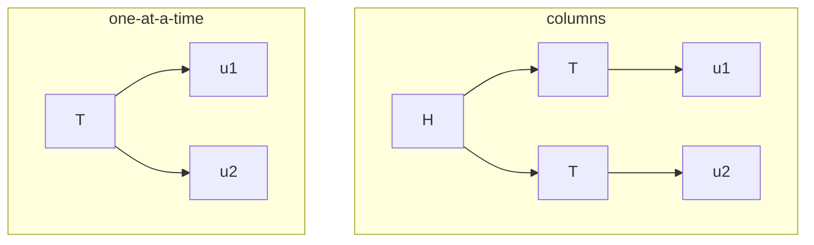
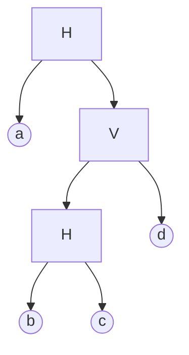
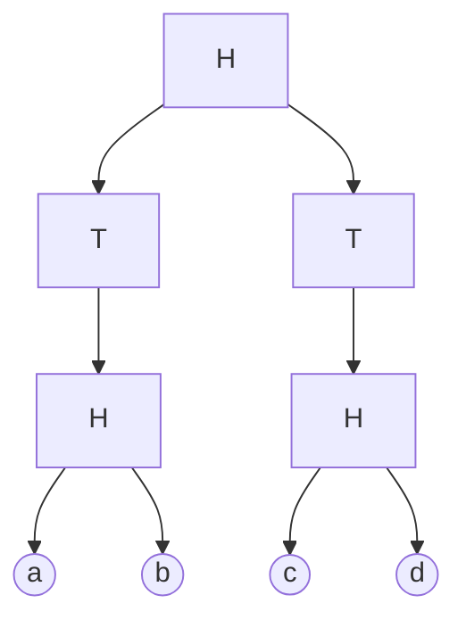
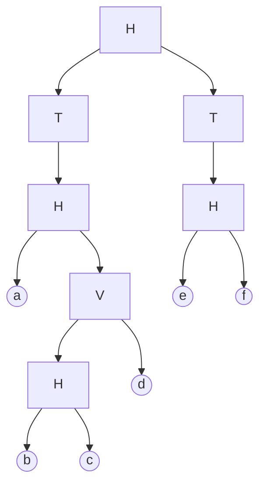
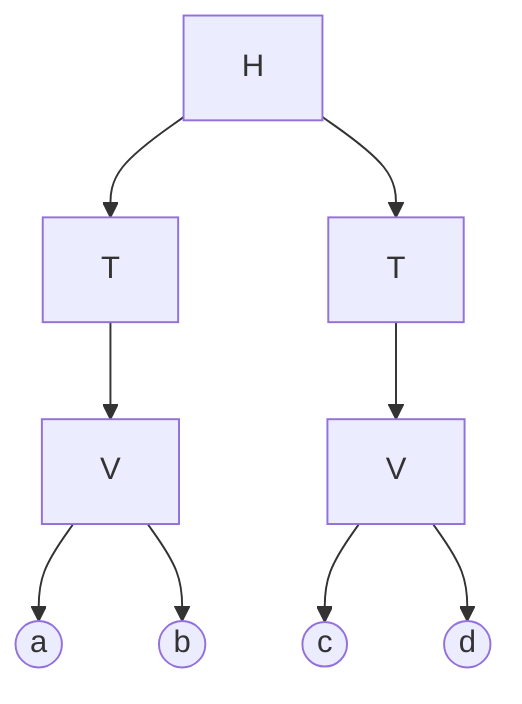
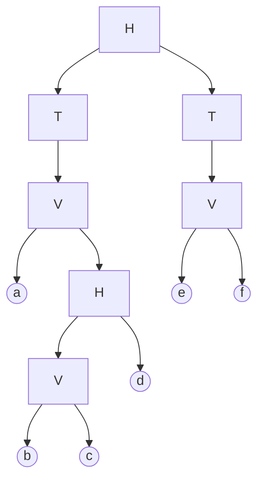
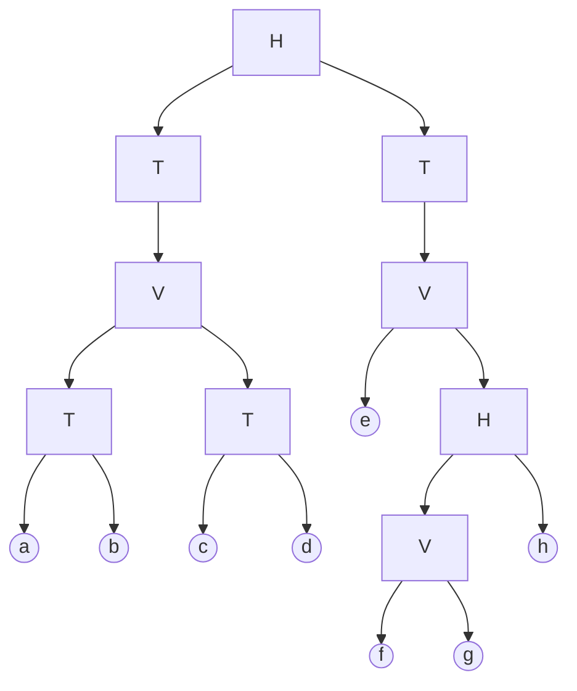

# hy3 Layout Recipes

Build deeply-nested hy3 layouts with the wired keybinds. Every layout is built
the same way -- **row -> fold -> tab-wrap** -- using `group_with` (the custom
`0002` patch) as the workhorse.

## Notation

- `H[...]` horizontal split (children side by side, left -> right)
- `V[...]` vertical split (children stacked, top -> bottom)
- `T[...]` tab group (children are tabs; one visible at a time)
- bare letters (`a`, `b`, ...) are windows (kitty terminals here)

In the **tree diagrams**: boxes = groups (`H` / `V` / `T`), circles = windows,
top = root, children read left-to-right in split order.

In the **ASCII screenshots**: plain boxes are windows; a tab group is drawn with
a `( x | y )` strip on its top edge listing its tabs, and only the **active**
(first-listed) tab's content is shown below it. Cycle tabs with `Super+[` /
`Super+]`. Proportions are approximate.

## Keybinds (the alphabet)

| goal | keys |
|---|---|
| spawn a window | `Super+t` |
| focus left / down / up / right | `Super+h/j/k/l` |
| group focused + right neighbour, **side-by-side (H)** | `Super+Shift+g` then `Ctrl+l` |
| group focused + right neighbour, **stacked (V)**, focused on top | `Super+Shift+g` then `l` |
| group focused + right neighbour, **as tabs (T)** | `Super+Shift+g` then `Shift+l` |
| select the enclosing group (go up one level) | `Super+a` (repeat to go higher) |
| wrap the selected group in a single tab (`T[ X ]`) | `Super+x` |
| pop focused out one level toward root | `Super+Shift+Ctrl+l` |
| cycle tabs | `Super+[` / `Super+]` |

Two tab moves that are easy to confuse:

- `Super+Shift+g`, `Shift+l` makes the two windows **separate tabs** -> `T[x,y]`.
- `Super+x` wraps the focused group as the **single content** of a new tab -> `T[ X ]`.
- `Super+g` toggles a group tab<->split *in place* (not a wrapper).

> The `group_with` *direction* (`l` = right neighbour) picks **which** node to
> grab; the *modifier* picks the new group's **orientation**. So you always fold
> a left-to-right row and just choose H / V / T per step. Folding a horizontal
> row pair `a|b` with `l` (V) gives `V[a,b]` (a on top).

## Method: row -> fold -> tab-wrap

1. **Row**: spawn all the windows into one left-to-right row (`Super+t` each; if
   one lands wrong, `Super+Shift+Ctrl+l` shoves it to the right end).
2. **Fold**: turn adjacent windows/groups into `H` / `V` / `T` groups with
   `group_with`. To fold a *group* into the next one, first `Super+a` to select it.
3. **Tab-wrap / finish**: see "Root style" below.

### Root style: columns vs one-at-a-time

The top level can either show the units **side by side** (each its own tab bar)
or as **one tab group** (one unit full-screen at a time, switch with
`Super+[` / `Super+]`). hy3's root node layout is immutable (the `0001` patch),
so "one tab" is achieved by wrapping the units in a tab group that becomes the
root's child -- same visual effect.

Given two finished units `u1`, `u2` sitting as root siblings, apply **exactly
ONE** of these finishes -- they are alternatives, NOT sequential steps. (Doing
columns *then* one-tab is the classic trap: the one-tab fold then either does
**nothing** -- the columns-wrapped unit `T[H[a,b]]` has no sibling for
`group_with` to grab, so it silently bails -- or, if you raise an extra level,
builds **nested double tab-bars** `T[ T[H[a,b]], T[H[c,d]] ]`. If a finish seems
to do nothing or looks wrong, doing both is almost always the cause.)

- **Columns (option A)** -> wrap each: `focus u1; Super+a; Super+x`, then same
  for `u2`. Result `H[ T[u1], T[u2] ]`.
- **One at a time (option B)** -> tab them together: `focus u1; Super+a (until
  the WHOLE unit is selected); Super+Shift+g, Shift+l`. Result `T[ u1, u2 ]`.



ASCII -- the same two units, both styles:

```
   columns  H[ T[u1], T[u2] ]          one-at-a-time  T[ u1, u2 ]
+( u1 )---------+( u2 )---------+    +( u1 | u2 )------------------+
|               |               |    |                            |
|     <u1>      |     <u2>      |    |            <u1>            |   Super+] -> <u2>
|               |               |    |                            |
+---------------+---------------+    +----------------------------+
```

> **The `Super+a` (raise) before either finish is mandatory** -- it is the step
> people skip. It selects the whole unit/group so the fold applies to the
> *group*, not the focused window. Skip it and `Super+x` / `group_with` act on
> the single focused window: you get one pair tabbed (`H[ T[a,b], H[c,d] ]`)
> instead of the two units (`T[ H[a,b], H[c,d] ]`). For a unit nested N levels
> deep, raise N times -- watch the selection highlight grow to cover the whole
> unit before you fold.

---

## Basic nesting (single unit)

### B-1 &nbsp; `H[a, V[V[b,c], d]]`

a fills the left half; the right half is vertical with the `b`-over-`c` pair on
top and `d` on the bottom. (The original `(a | ((b|c) - d))` retrofit.)


```
+---------------+---------------+
|               |       b       |
|               +---------------+
|               |       c       |
|       a       +---------------+
|               |               |
|               |       d       |
|               |               |
+---------------+---------------+
```

```
row: a b c d
focus b; Super+Shift+g, l        -> V[b,c]
Super+a; Super+Shift+g, l        -> V[V[b,c], d]
focus a; Super+Shift+g, Ctrl+l   -> H[a, V[V[b,c], d]]
```

### B-2 &nbsp; `H[a, V[H[b,c], d]]`

Same, but the inner pair is `b` *beside* `c` (horizontal).



```
+---------------+---------------+
|               |   b   |   c   |
|               +-------+-------+
|       a       |               |
|               |       d       |
|               |               |
+---------------+---------------+
```

```
row: a b c d
focus b; Super+Shift+g, Ctrl+l   -> H[b,c]
Super+a; Super+Shift+g, l        -> V[H[b,c], d]
focus a; Super+Shift+g, Ctrl+l   -> H[a, V[H[b,c], d]]
```

---

## Tabbed compositions -- H-based

Two units. Tree shown in **columns** form; the **one-at-a-time** form swaps the
top `H` for `T` and drops the per-unit `T` wrappers.

### H-1 &nbsp; columns `H[ T[H[a,b]], T[H[c,d]] ]` &nbsp; / &nbsp; one-tab `T[ H[a,b], H[c,d] ]`



```
columns:                             one-at-a-time:
+( a )---------+( c )---------+      +( a | c )-------------------+
|   a   |   b  |   c   |   d  |      |   a        |       b       |
|       |      |       |      |      |            |               |   Super+] -> c|d
+-------+------+-------+------+      +----------------------------+
```

```
row: a b c d
focus a; Super+Shift+g, Ctrl+l   -> H[a,b]   (u1)
focus c; Super+Shift+g, Ctrl+l   -> H[c,d]   (u2)
finish as COLUMNS (option A) : focus a; Super+a [RAISE -- selects the pair, MANDATORY]; Super+x   then   focus c; Super+a; Super+x
finish as ONE-TAB (option B; do A OR B, NOT both) : focus a; Super+a [RAISE -- selects the pair, MANDATORY]; Super+Shift+g, Shift+l
```

### H-2 &nbsp; columns `H[ T[H[a, V[H[b,c], d]]], T[H[e,f]] ]` &nbsp; / &nbsp; one-tab `T[ H[a, V[H[b,c], d]], H[e,f] ]`

(left unit is B-2; right unit is `e|f`)



```
+( a )--------------+( e )---------+
|      |  b  |  c   |   e   |   f  |
|  a   +-----+------+       |      |
|      |     d      |       |      |
+------+------------+-------+------+
```

```
row: a b c d e f
focus b; Super+Shift+g, Ctrl+l   -> H[b,c]
Super+a; Super+Shift+g, l        -> V[H[b,c], d]
focus a; Super+Shift+g, Ctrl+l   -> H[a, V[H[b,c], d]]   (u1)
focus e; Super+Shift+g, Ctrl+l   -> H[e,f]               (u2)
finish as COLUMNS (option A) : focus a; Super+a [RAISE -- selects the pair, MANDATORY]; Super+x   then   focus e; Super+a; Super+x
finish as ONE-TAB (option B; do A OR B, NOT both) : focus a; Super+a [RAISE -- selects the pair, MANDATORY]; Super+Shift+g, Shift+l
```

### H-3 &nbsp; columns `H[ T[H[T[a,b], T[c,d]]], T[H[e, V[H[f,g], h]]] ]`

one-tab form: `T[ H[T[a,b], T[c,d]], H[e, V[H[f,g], h]] ]`


```
+( a )-----------------+( e )---------+
|( a|b )  |( c|d )      |     |  f | g |
|   a     |   c         |  e  +----+---+
|         |             |     |    h   |
+---------+-------------+-----+--------+
   left half: two tab-pairs (a,b) and (c,d) side by side
```

```
row: a b c d e f g h
focus a; Super+Shift+g, Shift+l        -> T[a,b]
focus c; Super+Shift+g, Shift+l        -> T[c,d]
focus a; Super+a; Super+Shift+g, Ctrl+l-> H[T[a,b], T[c,d]]   (u1)
focus f; Super+Shift+g, Ctrl+l         -> H[f,g]
Super+a; Super+Shift+g, l              -> V[H[f,g], h]
focus e; Super+Shift+g, Ctrl+l         -> H[e, V[H[f,g], h]]  (u2)
finish as COLUMNS (option A) : focus a; Super+a Super+a [RAISE x2 -- selects the whole unit, MANDATORY]; Super+x   then   focus e; Super+a; Super+x
finish as ONE-TAB (option B; do A OR B, NOT both) : focus a; Super+a Super+a [RAISE x2 -- selects the whole unit, MANDATORY]; Super+Shift+g, Shift+l
```

(u1 is two levels deep, so it takes **two** `Super+a` to select the whole unit.)

---

## Tabbed compositions -- V-based (transposed)

Exactly the H-based set with every `H <-> V` swapped (tabs stay tabs). In the
recipes that is the single swap **`Ctrl+l` (H) <-> `l` (V)**; `Shift+l` and the
right-neighbour direction are unchanged.

### V-1 &nbsp; columns `H[ T[V[a,b]], T[V[c,d]] ]` &nbsp; / &nbsp; one-tab `T[ V[a,b], V[c,d] ]`



```
+( a )---------+( c )---------+
|      a       |      c       |
+--------------+--------------+
|      b       |      d       |
+--------------+--------------+
```

```
row: a b c d
focus a; Super+Shift+g, l   -> V[a,b]   (u1)
focus c; Super+Shift+g, l   -> V[c,d]   (u2)
finish as COLUMNS (option A) : focus a; Super+a [RAISE -- selects the pair, MANDATORY]; Super+x   then   focus c; Super+a; Super+x
finish as ONE-TAB (option B; do A OR B, NOT both) : focus a; Super+a [RAISE -- selects the pair, MANDATORY]; Super+Shift+g, Shift+l
```

### V-2 &nbsp; columns `H[ T[V[a, H[V[b,c], d]]], T[V[e,f]] ]` &nbsp; / &nbsp; one-tab `T[ V[a, H[V[b,c], d]], V[e,f] ]`



```
+( a )--------------+( e )---------+
|        a          |      e       |
+------+------------+--------------+
|  b   |            |      f       |
+------+     d      |              |
|  c   |            |              |
+------+------------+--------------+
```

```
row: a b c d e f
focus b; Super+Shift+g, l        -> V[b,c]
Super+a; Super+Shift+g, Ctrl+l   -> H[V[b,c], d]
focus a; Super+Shift+g, l        -> V[a, H[V[b,c], d]]   (u1)
focus e; Super+Shift+g, l        -> V[e,f]               (u2)
finish as COLUMNS (option A) : focus a; Super+a [RAISE -- selects the pair, MANDATORY]; Super+x   then   focus e; Super+a; Super+x
finish as ONE-TAB (option B; do A OR B, NOT both) : focus a; Super+a [RAISE -- selects the pair, MANDATORY]; Super+Shift+g, Shift+l
```

### V-3 &nbsp; columns `H[ T[V[T[a,b], T[c,d]]], T[V[e, H[V[f,g], h]]] ]`

one-tab form: `T[ V[T[a,b], T[c,d]], V[e, H[V[f,g], h]] ]`



```
+( a )----------+( e )-------------+
|( a | b )       |        e        |
|     a          +------+----------+
+----------------+  f   |          |
|( c | d )       +------+    h     |
|     c          |  g   |          |
+----------------+------+----------+
   left half: two tab-pairs (a,b) over (c,d)
```

```
row: a b c d e f g h
focus a; Super+Shift+g, Shift+l        -> T[a,b]
focus c; Super+Shift+g, Shift+l        -> T[c,d]
focus a; Super+a; Super+Shift+g, l     -> V[T[a,b], T[c,d]]   (u1)
focus f; Super+Shift+g, l              -> V[f,g]
Super+a; Super+Shift+g, Ctrl+l         -> H[V[f,g], h]
focus e; Super+Shift+g, l              -> V[e, H[V[f,g], h]]  (u2)
finish as COLUMNS (option A) : focus a; Super+a Super+a [RAISE x2 -- selects the whole unit, MANDATORY]; Super+x   then   focus e; Super+a; Super+x
finish as ONE-TAB (option B; do A OR B, NOT both) : focus a; Super+a Super+a [RAISE x2 -- selects the whole unit, MANDATORY]; Super+Shift+g, Shift+l
```

---

## Caveats

- With `autotile` on, the initial row rarely comes out perfectly flat -- spawn
  one at a time and nudge with `Super+Shift+Ctrl+l` until you have a clean
  left-to-right row before folding.
- The `Super+a` "select the group" raise is the #1 thing people skip or miscount
  (see the mandatory-raise callout in "Root style"). **Too few** raises and the
  fold hits the focused *window* -- you get one pair tabbed
  (`H[ T[a,b], H[c,d] ]`) instead of the two units (`T[ H[a,b], H[c,d] ]`);
  **too many** and it grabs an enclosing group. Watch the selection highlight
  cover exactly the unit before `Super+x` / the tab-fold.
- Same-orientation nesting (e.g. an `H` group directly inside the root `H`) is
  where hy3 sometimes collapses; if a fold does not stick, that is the spot to
  check.
- `group_with` is the `hy3:groupwith` patch (`overlays/0002`); bound as the
  `groupwith` submap on `Super+Shift+g` (then `hjkl` = V, `Shift+hjkl` = tab,
  `Ctrl+hjkl` = H). See `hyprland.nix`.
